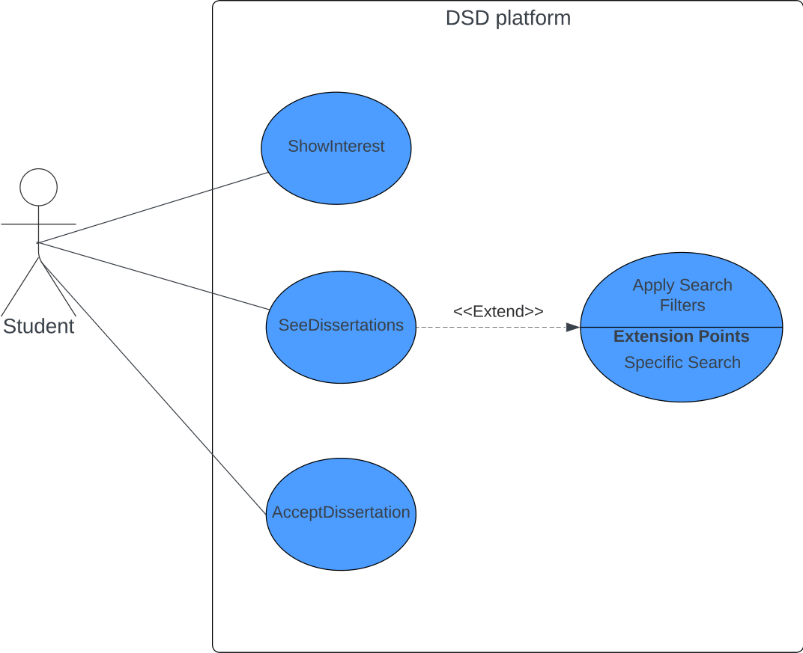
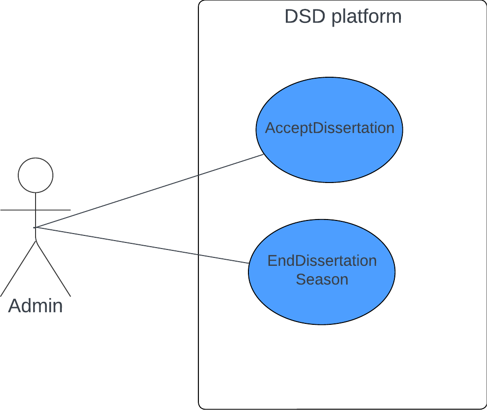

## Actors:

### Student: 

Makes use of the system as a potential user of the services provided by that system;

### Teacher:

Makes use of the system as a potential user of the services provided by that system;

### Admin:

Responsible for ensuring that the system is properly working, and intermediate contact between the other actors.

### Student: 

1. As a student  
I want to know more about some dissertations that i am interested  
so that i can select one;

2. As a student  
I want to know more about internship offers by DETI  
so that i can select an internship;

3. As a student  
I want to confirm my choice ("marriage") about one of the dissertations the supervisor confirmed  
so that i can start to work on that dissertation;

### Teacher:

1. As a teacher  
I want to be able to add the dissertations proposal's that I'am going to guide in that year, (could be or not co-supervised)  
so that student's can then read and show interest on them;

2. As a teacher
I want to confirm the "marriage" between me and the student that confirmed interest on my proposal
so that the next steps can be taken

### Admin:

 1. As an admin  
 I want to see if there are any unapproved dissertations proposed by supervisors  
 so they could be seen by all student's, after my approval;

2. As an admin  
I want to be able to add institute/companies logo's to the System DB  
so that those images can be used by proponents when adding a new dissertation;

## Use Cases (To be completed)

### Student:

1. Show interest - 

2. See dissertations -

3. Accept dissertation -

    

### Teacher:

1. Add dissertation proposal - 

2. Show interested students - 

3. Accept student - 

    

### Admin:

1. Accept dissertation - 

    

