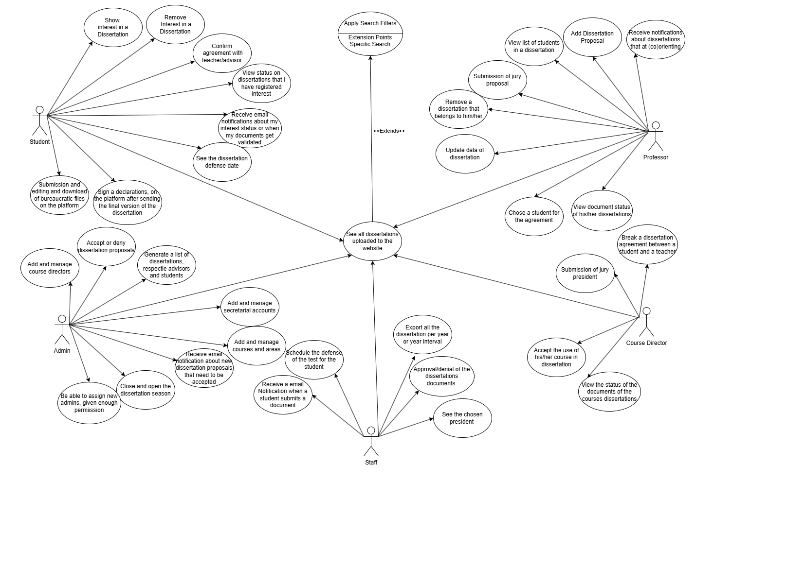

# Use Cases

## Actors

- __Student__
    - Makes use of the system as a potential user of the services provided by that system;
- __Professor__
    - Makes use of the system as a potential user of the services provided by that system;
- __Course Director__
    - Responsible for managing dissertations related to that given course;
- __Admin__
    - Responsible for ensuring that the system is properly working, and intermediate contact between the other actors.
- __Secretariat__
    - Responsible for regulating the submissions by the students and their current tuition situation.

## Use Case UML Diagrams

    

### Student

1. Show interest in a dissertation - Select a dissertation and register as interested in the system;

2. See all dissertations uploaded to the website - View all dissertation proposals in the form of a list, with the help of a search bar, get faster to specific dissertations;

3. Confirm agreement with professor/advisor - After acceptance of the professor, confirm the interest in the dissertation;

4. Remove interest in a dissertation - Remove the interest in a dissertation that was previously selected;

5. View Status of dissertations that I have registered interest - Keep up with the status of the dissertations that I have shown interest in;

6. Receive email notifications about my interest status updates - Receive email notifications about the status of the dissertations that I have shown interest in;

7. Submission of bureaucratic files on the platform (request for proof, declaration of acceptance, declaration of honor, arguer's proposal, pdf of the final version of the dissertation, proposal for publication in the DETI magazine);

8. Sign the copyright declaration, declaration of acceptance signed by the jury and the final and complete version of the dissertation;

9. See the dissertation defense date - See the date and room of defense in the defense details modal;

### Professor

1. See all dissertations uploaded to the website - View all dissertation proposals in the form of a list, with the help of a search bar, get faster to specific dissertations;

2. Add dissertation proposal - Add a dissertation proposal, composed of a file and metadata (title, description, etc...);

3. View list of interested students in a dissertation - Be able to see the students that showed interest in a dissertation I proposed to choose a student to work with;

4. Choose a student for the agreement - Finalize the process by confirming a student to work in a dissertation;

5. Update data of a dissertation - Be able to update the data of a dissertation that I proposed, like description, title, file, etc.;

6. Remove a dissertation that belongs to me - Be able to remove a dissertation that I proposed;

7. Receive email notifications about dissertations that I'm (co)orientating - Receive email notifications about the status of the dissertations that I have proposed, that I'm a co-advisor and the students that showed interest in them;

8. View document status of his/her disseratitions - See the status of all the documents submited by him or by the student of his dissertations;

9. Submission of jury proposal - Submit the jury proposal document;

### Course Director

1. Accept the use of his/her course in a dissertation - After a given dissertation has been uploaded and accepted by the administrator, the course director can accept/deny the use of their course in that particular dissertation;

2. Break a dissertation agreement between a student and a professor - After both the student and the professor agree on break the previous agreement, the course director can confirm that intention;

3. Submission of a jury president;

4. View document status of his/her disseratitions - See the status of all the documents submited by him or by the student of his dissertations;

### Admin

1. See all dissertations uploaded to the website - Be able to see all the dissertations that are in the platform and, with the help of a search bar, get faster to specific dissertations;

2. Accept or deny dissertation proposal - Accept or deny a dissertation proposal, depending on the quality of the proposal and other aspects that influence the decision to accept or deny it;

3. Close and open the Dissertation Season - Be able to open and close the dissertation season, so that no more dissertations can be added for the respective academic year;

4. Generate a list of dissertations, respective advisors and students - Generate a list of all the dissertations, their respective advisors and the students that are working on them;

5. Be able to assign new admins, given enough permission - Choose new admins to help with the management of the system but not with the same permissions as the original admin;

6. Receive email notifications about new dissertations proposals that need to be accepted - Receive email notifications about new dissertations that were submitted, for me to either approve or deny them;

7. Add and manage secretariat accounts;

8. Add and manage course directors;

9. Add and manage courses and areas;

### Secretariat

1. View all dissertations on the platform;

2. Approval/denial of the dissertations documents;
 
3. See the chosen president;

4. Schedule the defense of the test for the student;

5. Receive a email Notifican when a student submits a document;

## User stories

### Student

1. As a student  
I want to see a list containing all the dissertations that are available in the platform, with a search functionality to make it easier to find the ones that I am interested in;

2. As a student  
I want to know more about some dissertations that I am interested  
so that I can select one;

3. As a student  
I want to know more about internship offers by DETI so that I can select an internship;

4. As a student  
I want to check the status of the dissertations im interested in  
so that I can check if the professor has accepted me as the student for it;

5. As a student   
I want to remove my interest in a specific dissertation that I choose earlier

6. As a student  
I want to receive email notifications about the status of the dissertations that I have shown interest in

7. As a student   
I want to check regularly the status of the dissertations that I have shown interest in and others.

8. As a student
I want to check the details of my defense date.

### Teacher

1. As a professor  
I want to see all the dissertations that are present in the platform, so that I can see the ones that I proposed and the ones that other professors proposed, with search feature for me to speed up the process to find dissertations;

2. As a professor   
I want to be able to add the dissertations proposal's that I'm going to guide in that year, (could be or not co-supervised) so that student's can then read and show interest on them;

3. As a professor   
I want to confirm the agreement between me and the student that confirmed interest on my proposal so that the next steps can be taken;

4. As a professor  
I want to be able to update the data of a dissertation that I proposed, like description, title, file, etc.;

5. As a professor  
I want to be able to remove a dissertation that I proposed;

6. As a professor  
I want to be able to see the students that showed interest in a dissertation I proposed to choose a student to work with;

7. As a professor  
I want to receive email notifications about the status of the dissertations that I have proposed, that I'm a co-advisor and the students that showed interest in them;

8. As a professor
I want to see what are the document status of my dissertations;

9. As a professor 
I want to submit the jury proposal document;

### Course Director

1. As a course director
I want to be able to see all dissertations that belong to my course;

2. As a course director
I want to accept/deny if a dissertation is/isn't applicable to student enrolled on the course I am director;

3. As a course director
I want to be able to break an agreement between a student and professor, if they both agree on that;

4. As a course director
I want to see what are the document status of my dissertations;

5. As a course director 
I want to chose the president of the jury;

### Admin

1. As an admin  
I want to see if there are any unapproved dissertations proposed by supervisors so they could be seen by all student's, after my approval;

2. As an admin  
I want to be able to close and open the dissertation season, so that no more dissertations can be added for the respective academic year;

3. As an admin  
I want to be able to introduce/change features in the system so that the system can be improved and updated;

4. As an admin  
I want to be able to generate a list of all the dissertations, with their respective advisors and the students that are working on them so that I can send it to the academic services of the university;

5. As an original admin  
I want to be able to assign new admins, given enough permission to obtain more help with the management of the system but not with the same permissions as me;

6. As an admin  
I want to receive email notifications about new dissertations that were submitted, for me to either approve or deny them;

7. As an admin  
I want to see all the dissertations that are in the platform and, with the help of a search bar, get faster to specific dissertations;

### Secretariat

1. As a Secretariat 
I want to validate the documents;

2. As a Secretariat 
I want to see who is the president of the jury of a dissertations;

3. As a Secretariat 
I want to schedule the defense of the test for a student using the student nmec or the dissertation id;

4. As a Secretariat 
I want to receive email notifications about the submited documents;

