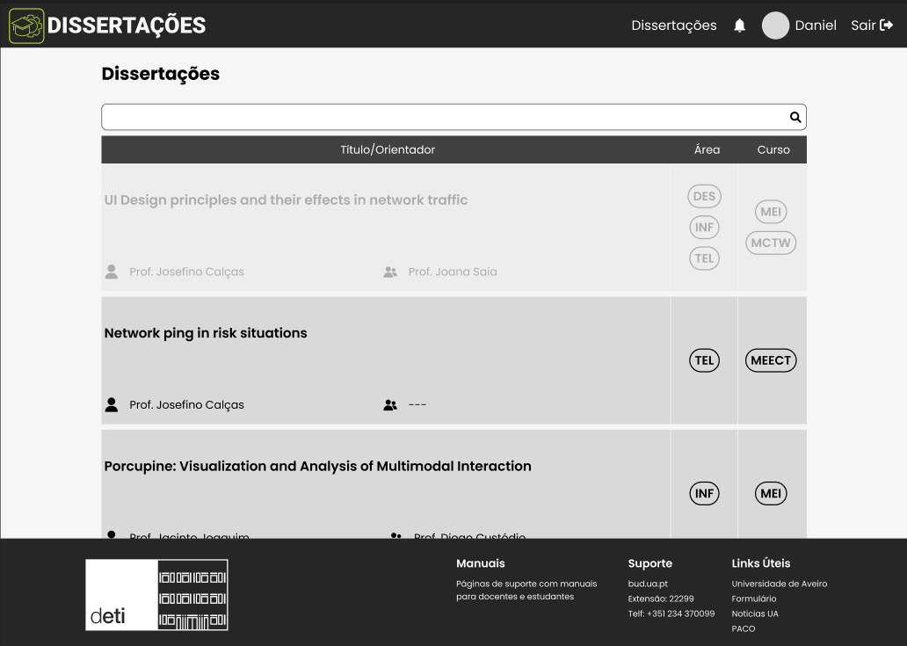
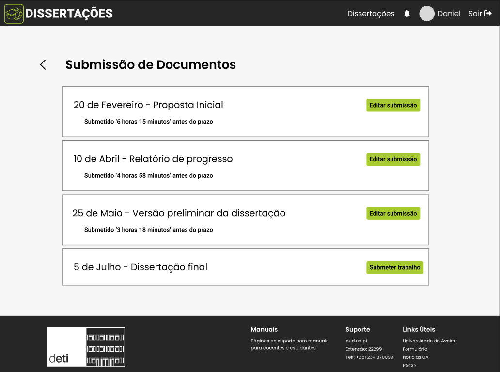
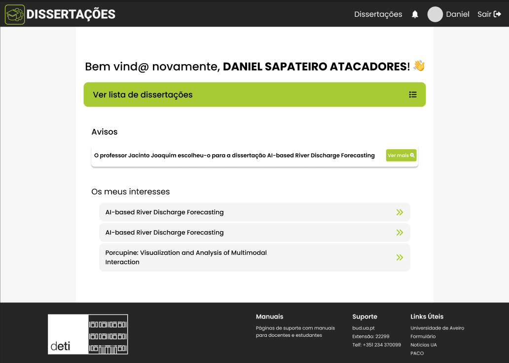

#### Prototype link: https://www.figma.com/file/JLCHHMr9t78a8Ez7kj5uzy/Protótipo?type=design&node-id=0-1&mode=design&t=u19e9mVM6SQowtC4-0

Add dissertation:

    

See list os dissertations:

    

List all dissertations by a professor:

    

Submit documents:

    

Notification/Reminders:

    

